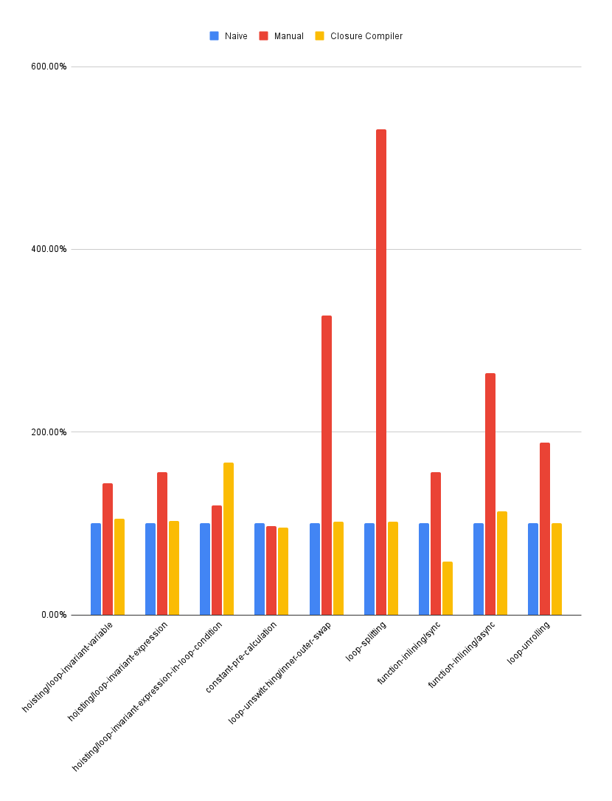

# JS Optimising Compiler Benchmarks

This repository contains benchmarks of optimisation techniques for JavaScript to JavaScript compilers.

Run `deno bench` to generate results.

Read [this article](https://ben.heidemann.dev/posts/optimizing-compilers-for-the-web) for analysis of these benchmarks.

## Results

|                                                      | Rate (iter/s) |            |                      | Rate (normalised) |                |                      |
|------------------------------------------------------|---------------|------------|----------------------|-------------------|----------------|----------------------|
| **Optimisation**                                     | **Naive**     | **Manual** | **Closure Compiler** | **Naive**         | **Manual**     | **Closure Compiler** |
| hoisting/loop-invariant-variable                     |         _9.7_ |       _14_ |               _10.2_ |               _1_ |  _1.443298969_ |        _1.051546392_ |
| hoisting/loop-invariant-expression                   |        _10.2_ |     _15.9_ |               _10.5_ |               _1_ |  _1.558823529_ |        _1.029411765_ |
| hoisting/loop-invariant-expression-in-loop-condition |        _28.7_ |     _34.3_ |               _47.8_ |               _1_ |  _1.195121951_ |        _1.665505226_ |
| constant-pre-calculation                             |        _12.4_ |       _12_ |               _11.8_ |               _1_ | _0.9677419355_ |       _0.9516129032_ |
| loop-unswitching/inner-outer-swap                    |        _46.2_ |    _151.3_ |                 _47_ |               _1_ |  _3.274891775_ |        _1.017316017_ |
| loop-splitting                                       |        _28.3_ |    _150.4_ |               _28.8_ |               _1_ |  _5.314487633_ |        _1.017667845_ |
| function-inlining/sync                               |        _54.2_ |     _84.7_ |               _31.6_ |               _1_ |  _1.562730627_ |       _0.5830258303_ |
| function-inlining/async                              |         _4.5_ |     _11.9_ |                _5.1_ |               _1_ |  _2.644444444_ |        _1.133333333_ |
| loop-unrolling                                       |        _22.4_ |     _42.2_ |               _22.5_ |               _1_ |  _1.883928571_ |        _1.004464286_ |
